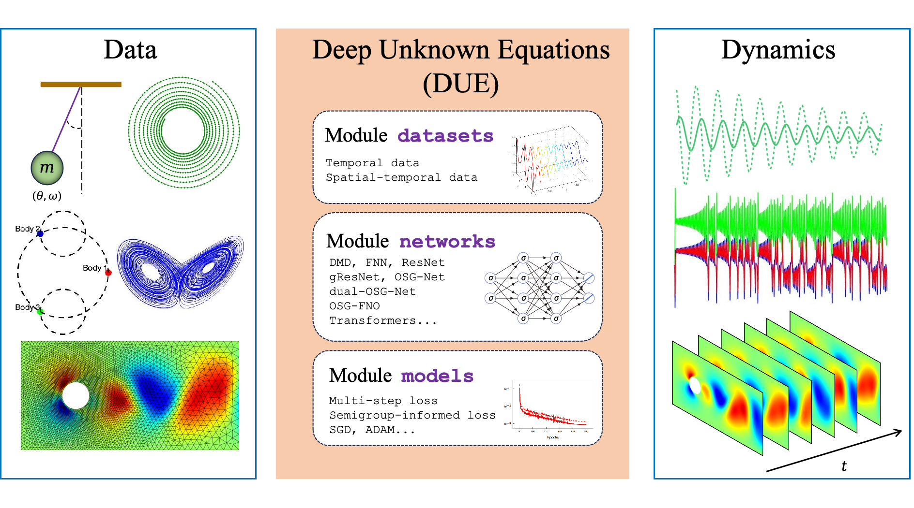

# DUE

Deep Unknown Equations (DUE) is an open-source software package designed to facilitate the data-driven modeling of unknown equations using modern deep learning techniques. It is also applicable for surrogate modeling of complex known equations that are costly to solve using traditional numerical methods. DUE is distinguished by its simplicity, allowing users to model unknown equations with as few as 10 lines of code.

<p align="center">
  
</p>
<!-- DUE is developped based on the following works
- Modeling unknown ordinary differential equations (ODE) by residual neural networks (ResNet) [[J. Comput. Phys.](https://doi.org/10.1016/j.jcp.2019.06.042)]
- Approximating unknown ODEs and differential-algebraic equations (DAE) by polynomials [[J. Comput. Phys.](https://doi.org/10.1016/j.jcp.2019.01.030)]
- Modeling unknown partial differential equations (PDE) in modal space [[J. Comput. Phys.](https://doi.org/10.1016/j.jcp.2020.109307)]
- Reconstructing unknown Hamiltonian systems from data by structure-preserving method [[SIAM J. Sci. Comput.](https://doi.org/10.1137/19M1264011)]
- Learning reduced systems via deep neural networks (DNN) with memory [[J. Mach. Learn. Model. Comput.](https://doi.org/10.48550/arXiv.2003.09451)]
- Modeling ODEs and DAEs by generalized residual neural networks (gResNet) [[J. Comput. Phys.](https://doi.org/10.1016/j.jcp.2021.110362)]
- Modeling unknown PDEs and integro-differential equations (IDE) in nodal space [[J. Comput. Phys.](https://doi.org/10.1016/j.jcp.2021.110782)]
- Learning operators in semigroup via deep learning [[J. Comput. Phys.](https://doi.org/10.1016/j.jcp.2023.112498)]
- Modeling unknown stochastic differential equations (SDE) via flow map operator [[J. Comput. Phys.](https://doi.org/10.1016/j.jcp.2024.112984)]
- Learning operators in PDEs by Position-induced Transformers [[ICML 2024](https://doi.org/10.48550/arXiv.2405.09285)] -->

## Installation

DUE, along with all its dependencies, can be installed through running the following command:

``` sh
$ pip install .
```

## Usage

The easiest way to get started with DUE is by running the provided templates in the ```examples/``` directory. To launch new learning tasks, simply modify these templates slightly and prepare custom datasets.

- For time series data with a fixed time lag, prepare a ```.mat``` file containing an array named "trajectories" with size ```(N, d, T+1)```, where ```N``` is the number of collected trajectories, ```d``` is the number of state variabes, and ```T``` is the number of time steps per trajectory. An optional second dataset of size ```(N', d, T'+1)``` can be used for model evaluation after training.

- For time series data with varying time lags, the ```.mat``` file should contain a second array named "dt" with size ```(N, T)```, storing the time step sizes between consecutive states.

- For spatiotemporal data with a fixed time lag, one or two additional dimensions are required to account for spatial variability. Use size ```(N,L,d,T+1)``` for point cloud data, where ```L``` is the number of spatial sampling points. Use size ```(N,H,W,d,T+1)``` for 2D Cartesian grid data, where ```H``` and ```W``` are the grid dimensions. Besides, the ```.mat``` file should contain a "coordinates" array with size ```(L, 1)```, ```(L, 2)``` or ```(H, W, 2)```, storing the locations of the sampling points. Currently, DUE is applicable for 1D and 2D problems.

- For spatiotemporal data with varying time lags, the ```.mat``` file should include a third array named "dt" with size ```(N, T)```, storing the time step sizes between consecutive snapshots.

## Dataset

All training and testing data for the demonstration examples can be downloaded <a href="https://drive.google.com/drive/folders/1efL-RR_H43Pe6P5BLtcEPFgz7ZmXnl5a?usp=sharing">here</a>.